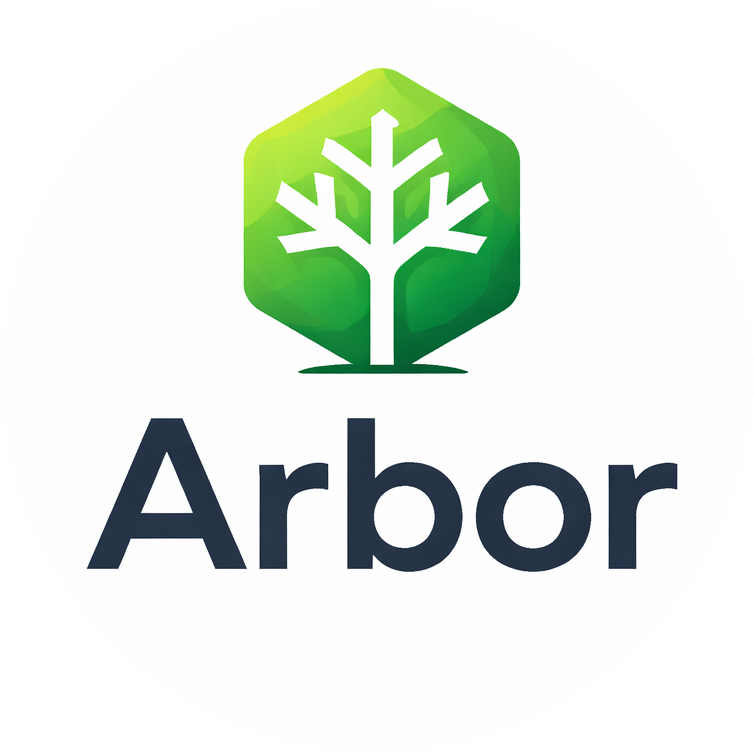

<p align="center">
  
</p>

# Arbor CMS — Detailed Documentation

A lightweight, structured Content Management System designed for developers who want full control over their content architecture.

Built with Next.js, TypeScript, Prisma, Tailwind CSS, and shadcn/ui.

---

## What is Arbor CMS?

Arbor CMS organizes content as a hierarchical page tree — similar to how files are structured in folders. Each page has a type, a position in the tree, and structured content fields. There are no drag-and-drop builders or inline editors. Everything is managed through clean, form-based admin screens.

Public URLs are generated directly from the page tree. When a visitor requests a URL, the system looks up the matching page, checks that it's published, and renders it. No manual route configuration needed.

---

## Key Concepts

### Page Tree
All pages live in a tree structure. Pages can be nested under other pages to create natural URL hierarchies like `/about`, `/about/team`, or `/blog/2026/hello-world`. The admin panel displays pages as a collapsible tree with icons, making it easy to visualize your content hierarchy.

### Page Types
Every page has a type (e.g., "Home", "Content", "Article") that determines what fields it has. Page Types are defined in code and automatically picked up by the system. The Home page type is special — only one can exist, and it always serves the root URL `/`. A Home page is automatically created when you set up your first admin account.

### Page Type Settings
Each page type can be configured through the admin UI with:
- **Icon** — Choose from a curated icon set to visually distinguish page types in the tree view.
- **Allowed Children** — Restrict which page types can be created as children under a given type.

These settings are managed entirely through the admin interface — no code changes required.

### Properties
Properties are the content fields within a page — things like title, description, or body text. Each Page Type declares which properties it uses, what type they are (text, rich text, image, etc.), and whether they're required. This keeps content structured and validated.

### File Management
Arbor CMS includes a built-in file manager accessible from the admin panel. Upload, organize, rename, and delete files in a hierarchical folder structure. Files and folders are stored in the database as binary blobs, making storage fully portable and persistent across deployments — no local filesystem or external storage service required. When pages are created, corresponding folders are auto-created for organizational convenience. The image property type integrates with the file manager via a visual selector modal.

The file explorer supports **drag-and-drop** to move files and folders between directories, and **sortable columns** — click any column header (Name, Size, Date Added, Modified) to sort, and click again to toggle ascending/descending order. Arrow indicators show the current sort direction.

### Rich Text Editor
Rich text properties use a full WYSIWYG editor powered by TipTap. The editor supports bold, italic, underline, strikethrough, headings, font sizes, text color, bullet/ordered lists, text alignment, blockquotes, code blocks, and horizontal rules. A raw HTML mode toggle lets you view and edit the underlying HTML directly, with changes syncing between modes. The editor area has a capped max-height and scrolls when content is large, keeping the form layout manageable.

### Page Editor with Live Preview
When editing a page, the admin shows a split-pane layout: the edit form on the left and a live preview on the right. The preview renders using the same page templates as the public site, updating in real time as you type. A draggable divider between the panels lets you adjust the split to your preference (20%–80%). You can toggle the preview on or off, and a "View Live" link opens the published page in a new tab.

### Theme System
Arbor CMS has a dual-theme system that lets you control the admin interface and live site appearance independently. From **Settings > Theme**, you can choose between Auto, Light, or Dark for both:
- **CMS Admin** — Applies to the admin panel, login, and setup pages.
- **Live Site** — Applies to all public-facing pages.

Auto follows your operating system preference. Themes are persisted in localStorage and apply instantly without page flicker thanks to an inline script that runs before React hydrates.

### Site Navigation
The live site includes a responsive navigation bar that displays top-level published pages. Navigation is configured through the Settings page:
- **Enable/disable** the navigation bar globally.
- **Site title** — text shown next to the logo.
- **Logo image** — selected from the built-in file manager.

Per-page control is available in the page editor for top-level pages:
- **Show in Navigation** — toggle whether the page appears in the nav bar.
- **Navigation Label** — custom display label (defaults to Title Case of the slug).

Only top-level pages (not nested children) can appear in the navigation. On mobile, the nav collapses into a hamburger menu that opens a side panel overlay.

### Site Footer
A standard footer is rendered on all public pages with:
- **Logo image** — selected from the file manager.
- **Footer text** — displayed alongside an automatic copyright year.
- **Enable/disable** toggle in Settings.

### Admin Panel
A clean, consistent admin interface at `/admin` lets you manage pages, view registered page types, configure page type settings, adjust theme preferences, configure navigation and footer, and publish content. The sidebar is collapsible — click the chevron to shrink it to icon-only mode for more workspace. On first launch, you'll set up an initial administrator account — a Home page is created automatically so you can start building immediately.

### Widget System
Widgets are composable content blocks that can be added to any page through the admin UI. Each page template defines named widget areas (e.g., "main", "sidebar"), and admins can add, configure, reorder, and remove widgets within those areas. The system includes 12 built-in widgets across 5 categories:

- **Content** — Heading, Rich Text, Button
- **Media** — Image, Hero Banner
- **Layout** — Section (container), Columns (container), Spacer, Divider
- **Interactive** — Form
- **Advanced** — Page List, HTML

Widget props are configurable per type — text, rich text, images, colors, booleans, select dropdowns, and more. Widgets are defined in code but managed entirely through the admin interface.

### Container Widgets
Section and Columns are special container widgets that wrap other widgets inside them. Section provides a styled wrapper with background color and padding options. Columns arranges child widgets into a 2 or 3 column grid with configurable layout ratios. Child widgets are placed into named slots, and containers cannot be nested inside other containers. The admin widget editor shows inline slot management when editing a container.

### Form System
The Form widget lets admins create custom forms with configurable fields (text, email, textarea, select, checkbox, radio). Form definitions are stored independently as **Form Types**, which survive even if the original widget is deleted. When creating a Form widget, admins can reuse an existing Form Type or create a new one. Submissions are viewable in a dedicated admin section at `/admin/forms`, grouped by Form Type.

---

## Project Structure

```
app/              → Pages and API routes (Next.js App Router)
  admin/          → Admin UI (protected)
    files/        → File manager page
    forms/        → Form submissions admin pages
  api/            → REST endpoints for mutations
    storage/      → File management API
    widgets/      → Widget CRUD, areas, reorder, form-submit, page-list
    form-types/   → FormType CRUD API
    forms/        → Form submission queries
  [[...slug]]/    → Catch-all public page routing
components/
  ui/             → Shared UI components (shadcn/ui-based: Button, Input, Card, Badge, Dialog, etc.)
  admin/          → Admin-specific components (sidebar, page tree, page preview, file explorer, rich text editor, widget editor, form elements editor)
  site/           → Live site components (navigation bar, footer, site layout wrapper)
  theme-provider  → Dual-theme context provider (admin + live site)
lib/
  auth/           → Authentication and session management
  page-types/     → Page Type definitions and registry
  page-template/  → Page Template components and registry
  properties/     → Property validation and defaults
  widgets/        → Widget system (types, registry, renderer, definitions, renderers)
  icons.ts        → Curated SVG icon set for page types
  utils.ts        → Utility functions (cn class merger for shadcn/ui)
  storage/        → Database-backed file storage (types, DB operations, index)
prisma/           → Database schema and migrations
docs/             → Release notes and documentation
guide/            → Developer guides for extending the CMS
```

---

## Guides

- [How to Create a New Page Type](../guide/how-to-create-a-new-page-type.md)
- [How to Create New Properties](../guide/how-to-create-new-properties.md)
- [How to Create a New Widget](../guide/how-to-create-a-new-widget.md)
- [How to Create a Form](../guide/how-to-create-a-form.md)
- [How Forms Work](../guide/how-forms-work.md)

---

## Release Notes

- [v2.0.0](v2.0.0-update.md)
- [v1.5.0](v1.5.0-update.md)
- [v1.4.0](v1.4.0-update.md)
- [v1.3.2](v1.3.2-update.md)
- [v1.3.1](v1.3.1-update.md)
- [v1.3.0](v1.3.0-update.md)
- [v1.2.0](v1.2.0-update.md)
- [v1.1.1](v1.1.1-update.md)
- [v1.1.0](v1.1.0-update.md)
